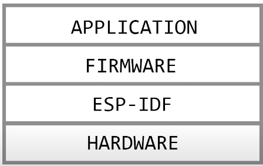
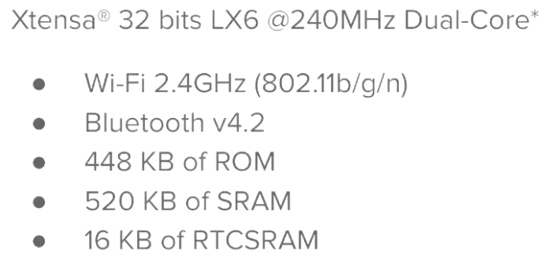
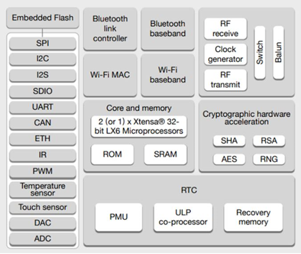
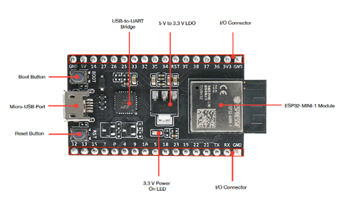
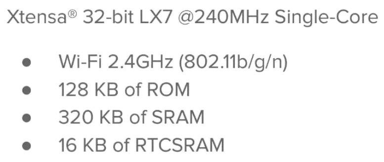
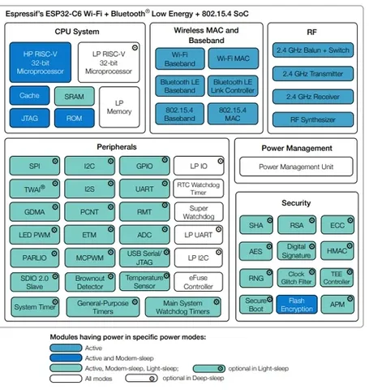

# Introdução com ESP-IDF e ESP32

Esp32 é uma família de Socs desenvolvidos pela Espressif System. Possui um hardware poderoso, versátil e de baixo custo, permitindo projetos IOT e comunicações com Wifi e Bluetooth embutidos. O ESP-IDF é um framework gratuito também desenvolvido pela Espressif que fornece um SDK para desenvolvimento de diversas aplicações, utilizando a linguagem C/C++.
Uma das vantagens é que o framework ESP-IDF se comunica mais próximo do Hardware e com isso maior velocidade de processamento.

https://embarcados.com.br/webinar-como-escolher-o-melhor-esp32-para-o-seu-proximo-projeto-de-iot/

## ESP32

Arquitetura

-	Microprocessador dual-core Tensilica LX6 240 MHz com um desempenho de 600 DMIPS.
-	Possui 520 KB SRAM, há 16 MB de memória flash na placa.
-	O chip é alimentado por uma tensão de 2,2 a 3,6 V.
-	Temperatura ambiente possível de -40 ° C a 125 ° C.
-	Em sono profundo(Deep Sleep), o ESP32 consome 2,5 μA, de acordo com o fabricante.
-	Baixo consumo de energia é fornecido por um processador ULP (Ultra-Low-Power).
-	16 Kbytes de dados e programas podem ser armazenados na SRAM do RTC (relógio de tempo real) para que o acesso a temporizadores, interrupções e periféricos seja possível, mesmo no modo de hibernação profunda.
-	Para se comunicar com o mundo externo, o SoC (Sistema em um Chip) inclui o componente HT40 802.11b / g / n WiFi e a funcionalidade Bluetooth.
-	Além da antena PCB integrada, um componente externo pode ser conectado por meio de um conector IPEX.
-	Como sensores, o ESP32 possui um sensor Hall, uma touch button capacitivo, um amplificador analógico de baixo sinal e um quartzo de cristal de 32 kHz.
- ESP32 possui 18 canais analógicos de 12 bits, ou seja, pinos que podem converter esse sinal para digital.

 

Layout do Esp32

 

ESP32-S2

## Família de Socs ESP32

A família ESP32 é uma linha de microcontroladores (MCUs) com Wi-Fi integrado e conectividade Bluetooth. O ESP32 inclui quatro famílias: ESP32, ESP32-S, ESP32-C e ESP32-H

