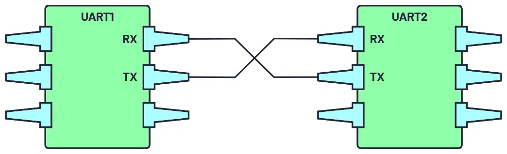
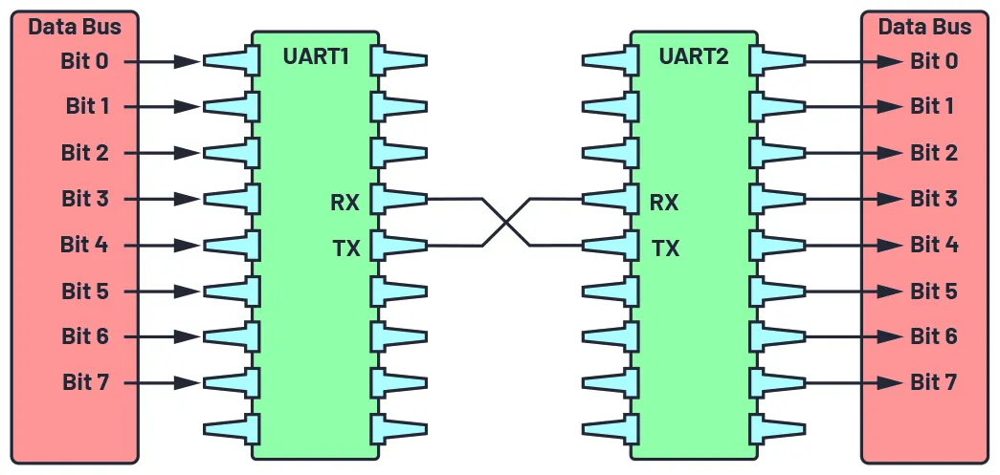
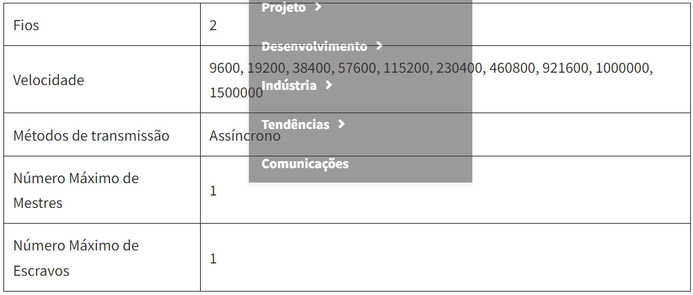
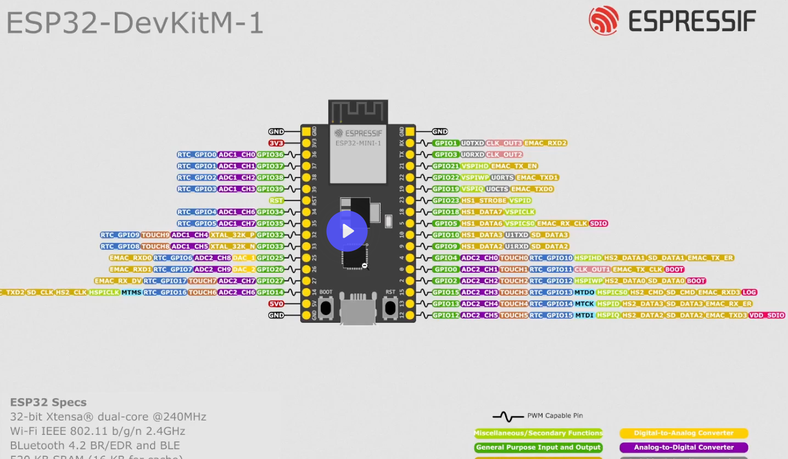

# 13-Comunicação serial

## Introdução UART

- Universal Asynchronous Receiver/Transmitter
- Full duplex or Half duplex
- Baud rates from 110 - 921600 or arbitrary up 3Mbps
- Padrões de comunicação serial baseados em UART:
- RS-232
- RS-485

Na comunicação serial, os dados são transferidos bit a bit usando uma única linha ou fio, na comunicação bidirecional utilizamos um par de fios, com isso reduz o custo de uma implementação. O envio de dados ou pacotes são chamados dedata frame(quadro de dados).
UART é um protocolo de comunicação de hardware que usa comunicação serial assíncrona com velocidade configurável. Assíncrono significa que não há sinal de clock para sincronizar os bits de saída do dispositivo transmissor indo para a extremidade receptora.

O transmissor de um dispositivo é conectado ao receptor do outro dispositivo e vice versa.
São transmitidos bit a bit, convertendo os dados em paralelos. Ataxa de transmissão devem ser definidas tanto no receptor quanto no emissor.

A interface UART não utiliza um sinal de clock para sincronizar os dispositivos transmissor e receptor; ela transmite dados de forma assíncrona. Em vez de um sinal de clock, o transmissor gera um fluxo de bits com base em seu sinal de clock enquanto o receptor usa seu sinal de clock interno para amostrar os dados de entrada. O ponto de sincronização é gerenciado tendo a mesma taxa de transmissão em ambos os dispositivos. Deixar de fazer isso pode afetar o tempo de envio e recebimento de dados, o que pode causar discrepâncias durante o manuseio de dados. A diferença permitida de taxa de transmissão é de até 10% antes que o tempo dos bits fique muito distante.

O ESP32 possui 3 UART's, um é utilizado pelo soc, mais é possível desabilitar o console padrão e utilizar.
ESP32 possui 18 canais analógicos de 12 bits, ou seja, pinos que podem converter esse sinal para digital. 
A UART 2 não esta mapeada na imagem abaixo.

## Bibliografia

https://docs.espressif.com/projects/esp-idf/en/v5.1.1/esp32/api-reference/peripherals/uart.html

https://docs.espressif.com/projects/esp-idf/en/v5.1.1/esp32/api-reference/peripherals/uart.html

https://www.embedded.com/understanding-the-uart/