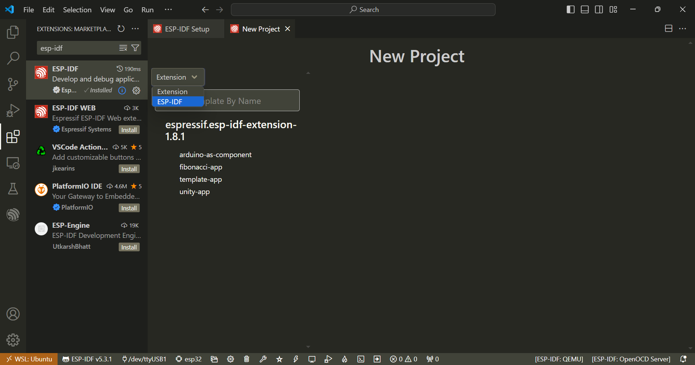

# Instalação passo a passo do ESP-IDF no Ubuntu

## Documentação

https://docs.espressif.com/projects/esp-idf/en/v5.1.4/esp32/get-started/linux-macos-setup.html

https://github.com/espressif/vscode-esp-idf-extension/blob/master/docs/tutorial/wsl.md#usbipd_instructions

## Instalação e pré-requisitos

### Instalação do WSL


### Escolher Versão Linux acima das versões 20 nesse caso foi a 22.04


### Ferramenta USBIPD para realizar o Bind

```
Winget install usbipd
```


### Instalação dos pacotes de ferramentas de pre-requisito no Linux 

https://docs.espressif.com/projects/esp-idf/en/v5.3.1/esp32/get-started/linux-macos-setup.html

```
sudo apt-get install git wget flex bison gperf python3 python3-pip python3-venv cmake ninja-build ccache libffi-dev libssl-dev dfu-util libusb-1.0-0
```


```
wsl -s ubuntu
```


### Instalação do Framework ESP-IDF

```
mkdir -p ~/esp
cd ~/esp
git clone -b v5.3.1 --recursive https://github.com/espressif/esp-idf.git
```


Entrando na pasta do ESP-IDF é possível verificar a instalação do Framework e todos os diretórios


Agora o script de instalação das variáveis de ambiente

```
./install.sh
```


Agora exportar as variáveis de ambiente


```
. ./export.sh
```

No PowerShell

```
usbipd list
```


Inserindo a placa na USB


Agora podemos encontrar o BUSID para realizar o Bind

```
usbipd bind --busid <BUSID>
```

```
usbipd attach --wsl --busid <BUSID>
```

```
usbipd detach --busid <BUSID>
```


Fazendo novamente o comando `usbipd list`


No terminal do Ubuntu 

```
dmesg | tail
```


Configuração das variáveis de ambiente no Ubuntu

```
. $HOME/esp/esp-idf/export.sh
```
Digitar i para inserir dados


clicar em `ESC` depois `:wq` para salvar e sair


Atualizar a configuração do arquivo .basshrc

```
$ source ~/.bashrc
```


Diretório de instalação do ESP_IDF no Ubuntu


Configuração do VSCode

Instalação de extensões


### Conectando no WSL com o VSCode


> Caso tenha duas versões posso escolher qual a distro desejo clicando em `Connect to WSL using Distro ...`

> Clicando em Open folder


A configuração da máqiuna virtual não herda as configurações da máquina Host

Configuração da extensão ESP-IDF


<mark> ### VMWARE Problema no VSCode ### </mark>

## VMWARE a configuração no VSCode não funcionou corretamente, apenas a configuração manual funcionou corretamente


Inserir no campo de pesquisa das configurações do VSCode

Abrir a página de configuração


> Verificar o caminho do diretório e clicar em install, ele não irá instalar mais irá configurar a versão já existente


Agora o VSCode informa a necessidade3 de instalação





<mark>
@ext:espressif.esp-idf-extension port
</mark>

```
sudo apt-get install git wget flex bison gperf python3 python3-pip python3-venv cmake ninja-build ccache libffi-dev libssl-dev dfu-util libusb-1.0-0
```


Comando no linux para encontrar os dispositivos conectados bem como portas usb

```
lsusb
```


Clicar em backup e Sync settings e entrar com a conta do Github


