# INSTALACAO_ESP-IDF_WiNDOWS

## Instalação Manual

# Getting Started Guide

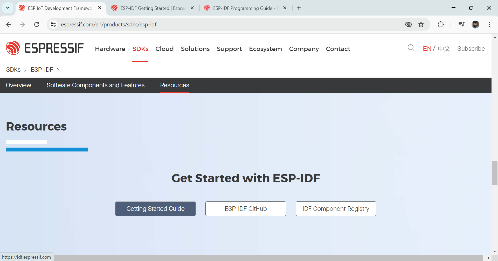

https://docs.espressif.com/projects/esp-idf/en/stable/esp32/index.html

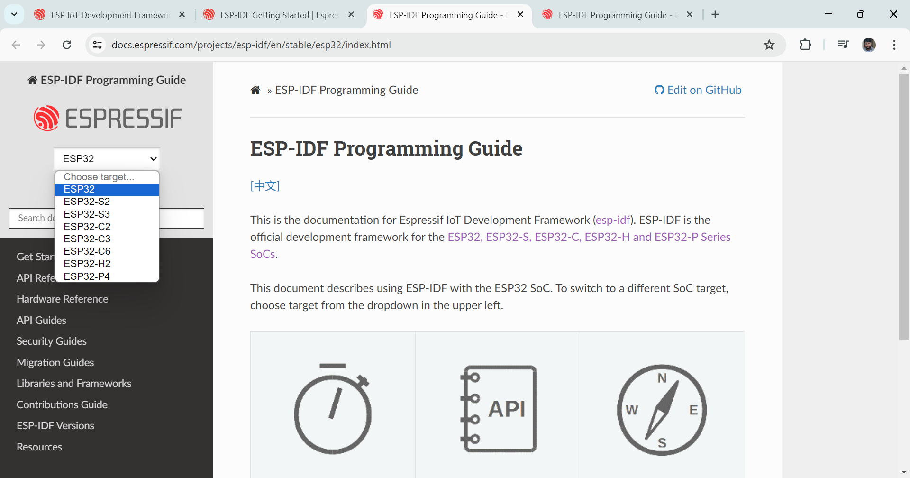

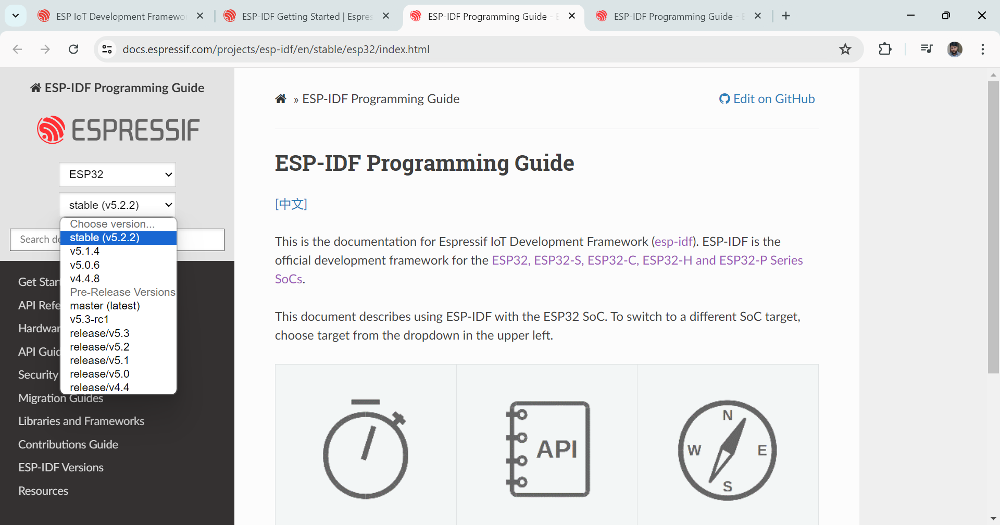

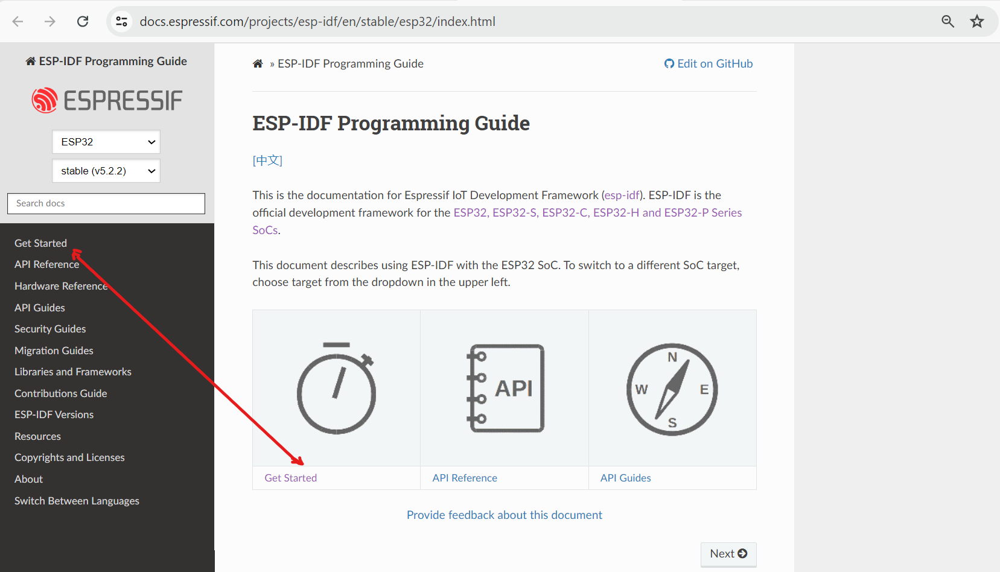

# Download do ESP-IDF e IDE Eclipse

https://github.com/espressif/idf-eclipse-plugin/blob/master/docs_readme/Espressif-IDE-Windows-Installer.md

https://dl.espressif.com/dl/esp-idf/

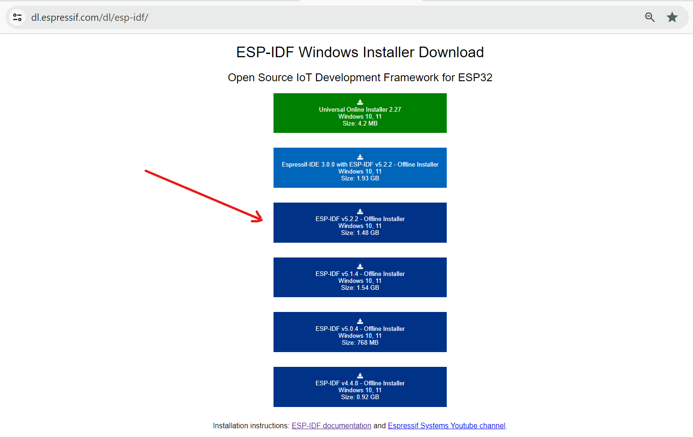

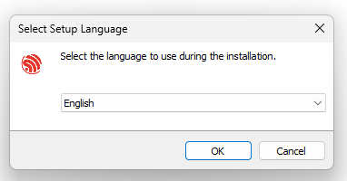

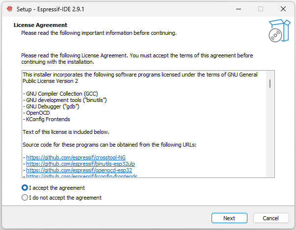

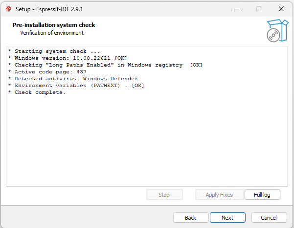

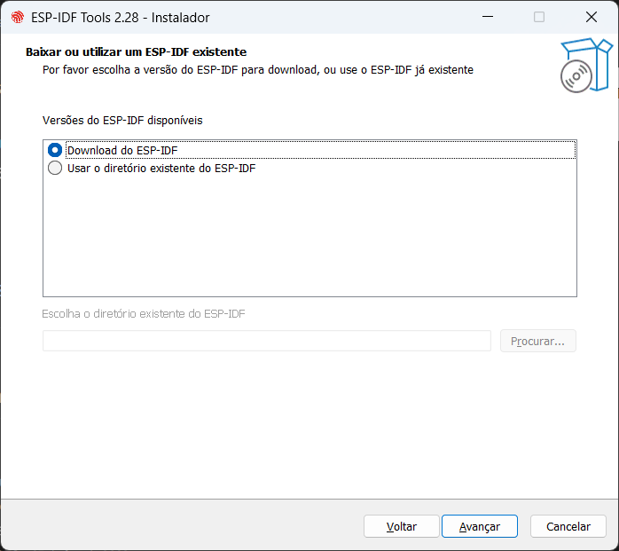

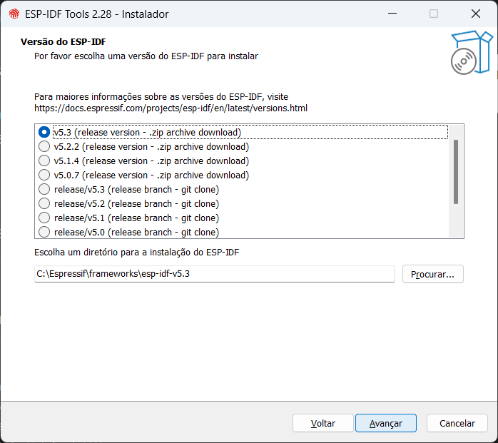

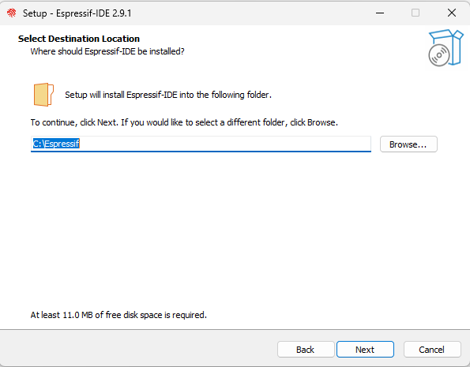

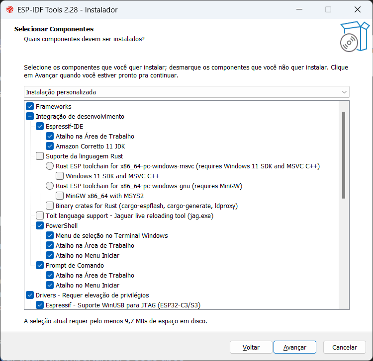

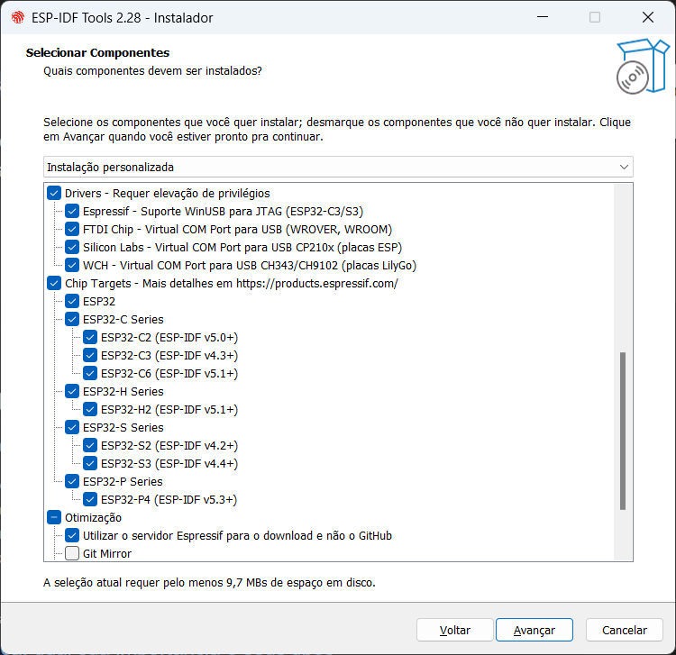

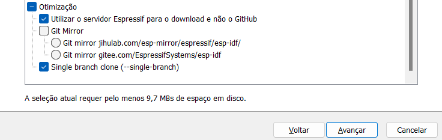

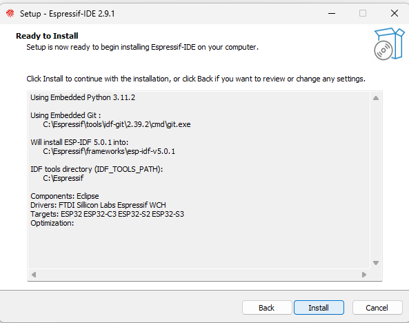

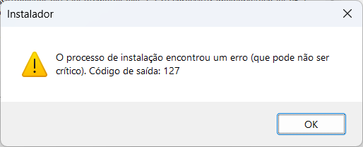

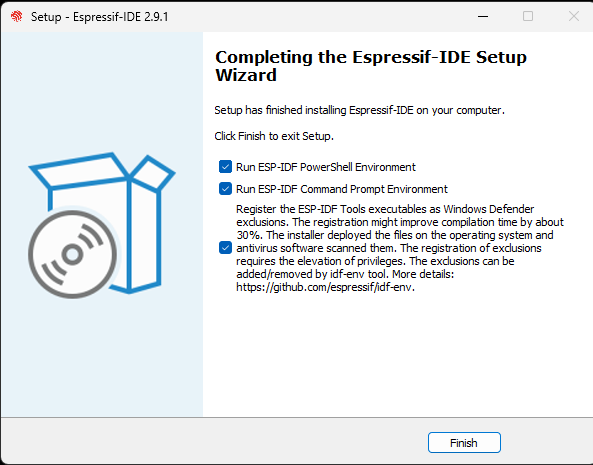

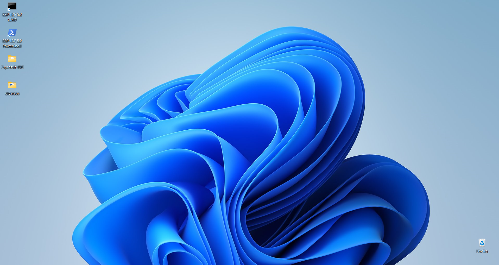

# Adicionar a tabela de aplicativos confiáveis

> Abra seu Kaspersky;
Clique em configurações;
Vá em configurações de segurança;
Encontre configurações avançadas;
Clique em exclusões e ações na detecção de objetos;
Role tudo e encontre 'Especificar os aplicativos confiáveis';
Clique em ADICIONAR, ache o programa e selecione ele;
Marque todas as caixinhas menos aquela que consta [] Não verificar tráfego criptografado [];
Clique em 'OK' e depois 'OK' de novo, clique em SALVAR e confirme o SALVAMENTO;

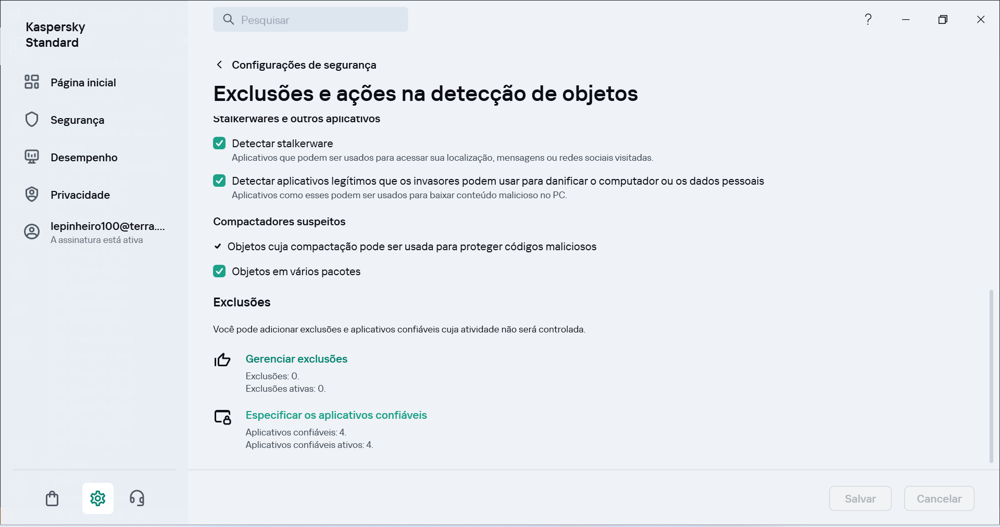

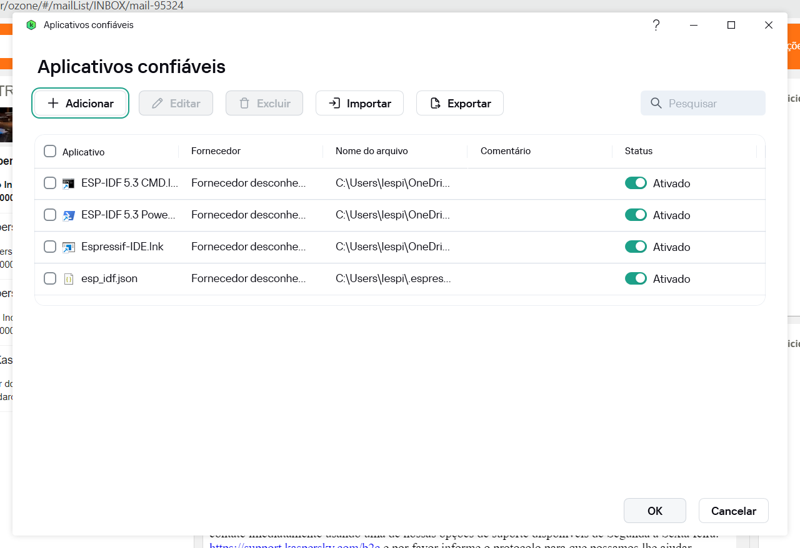

# Documentação do ESP-IDF

https://docs.espressif.com/projects/esp-idf/en/v5.1.4/esp32/index.html

> Escolher o Soc, nesse caso todo o ecosistema do ESP32

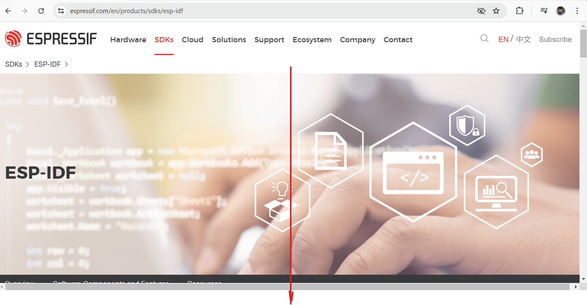

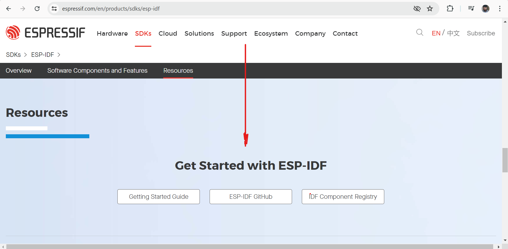

