# INSTALACAO_ESP-IDF_WiNDOWS

## Instalação Manual

### Getting Started Guide

https://docs.espressif.com/projects/esp-idf/en/v5.3/esp32/index.html


https://docs.espressif.com/projects/esp-idf/en/v5.3/esp32/get-started/windows-setup.html


https://docs.espressif.com/projects/esp-idf/en/v5.3/esp32/get-started/windows-setup.html


https://dl.espressif.com/dl/esp-idf/?idf=4.4


### Antes de iniciar a instalação foi preciso desativar o Antivírus Kaspersky


### Posso modificar o


### Verificação dos pré-requisitos

- verificar se esta tudo ok


## Escolher se deseja fazer o download ou apenas configurar um diretório existente


### Diretório de instalação de ferramentas necessárias para o funcionamento do ESP-IDF 

- Toolchains


### Selecionar os módulos desejados para a instalação


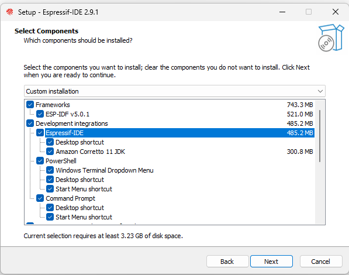


### Verificar a versão


### Verificar os comandos


### Criando um projeto de exemplo

- No link abaixo podemos criar um projeto Hello World

https://docs.espressif.com/projects/esp-idf/en/v5.3/esp32/get-started/windows-setup.html


### Suporte a BSP Espressif Board Suport Packages

https://github.com/espressif/esp-bsp


- Comandos para trabalhar com o ESP-IDF

```
idf.py set-target esp32
```
```
idf.py build
```
```
idf.py -p PORT flash
```
```
idf.py -p PORT monitor
```

## Configuração do VSCode

- Extensão da Espressif


### Configuração do ESP-IDF no VSCode


### Utilizar o Setup existente de instalação


### Criando um novo projeto


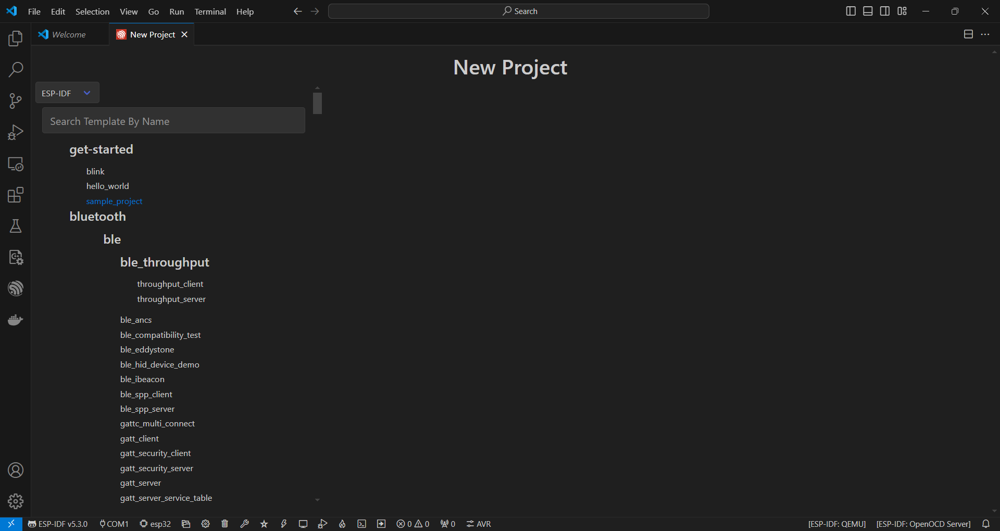

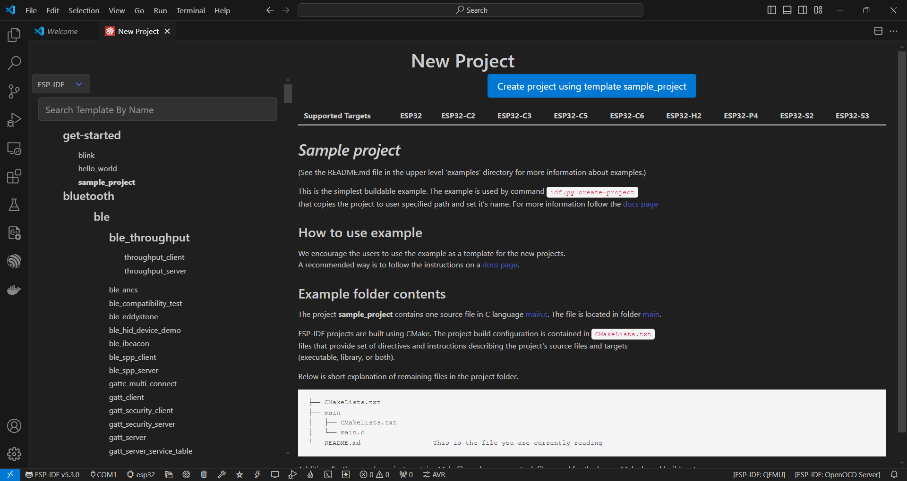

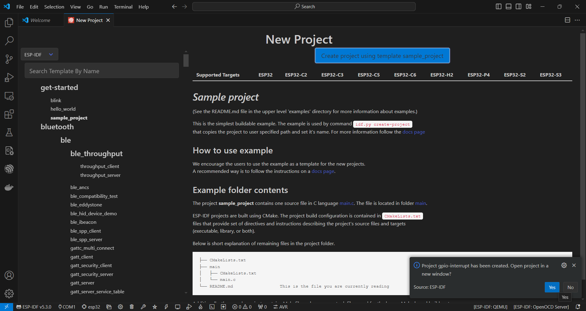

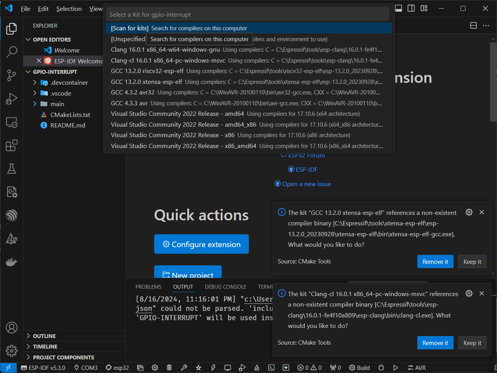

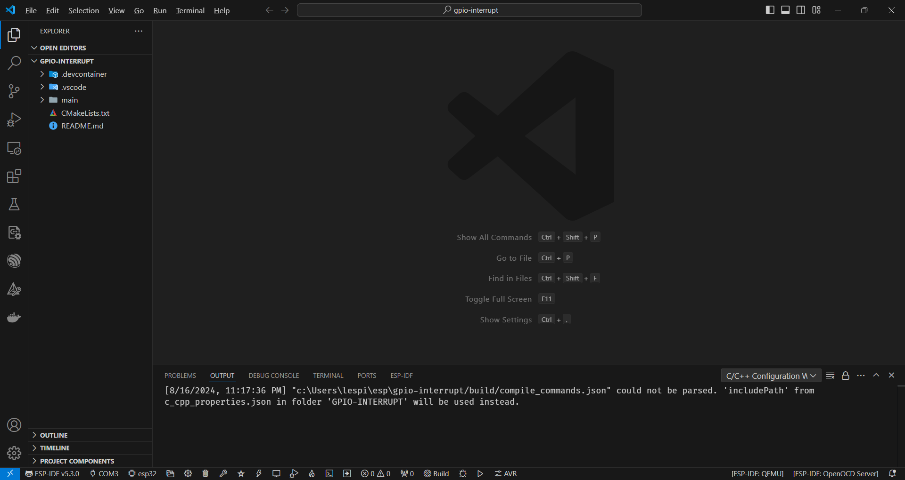

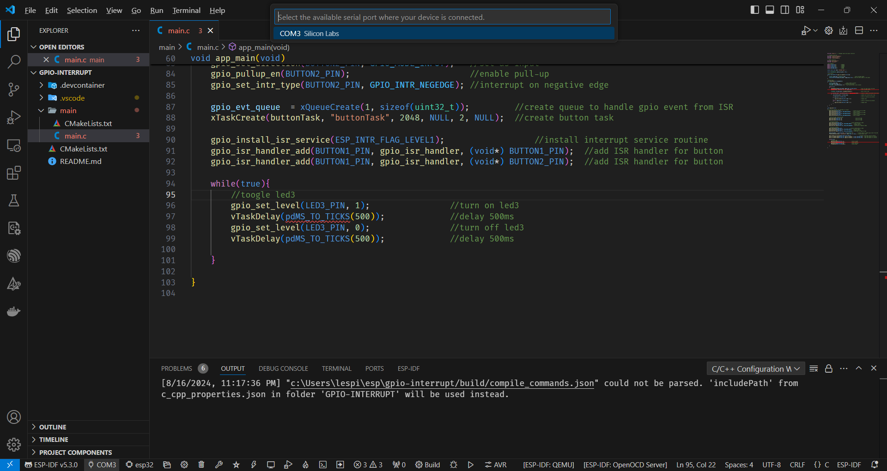

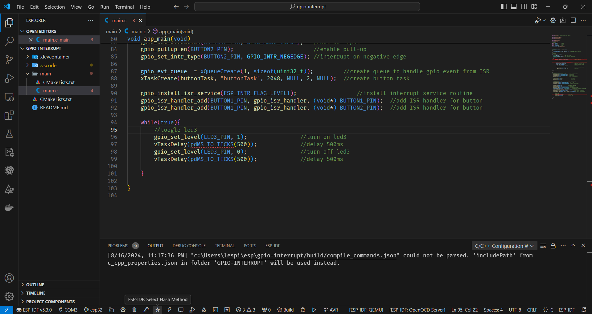

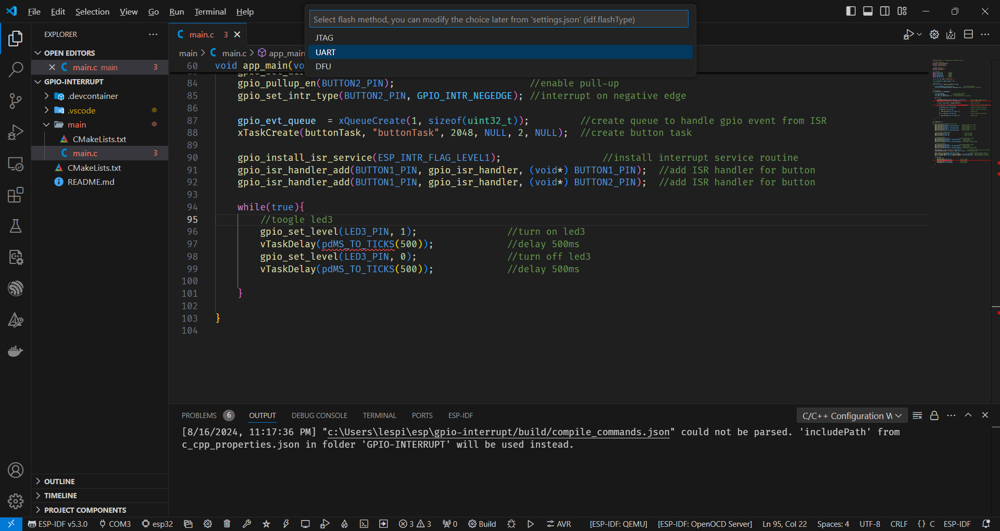

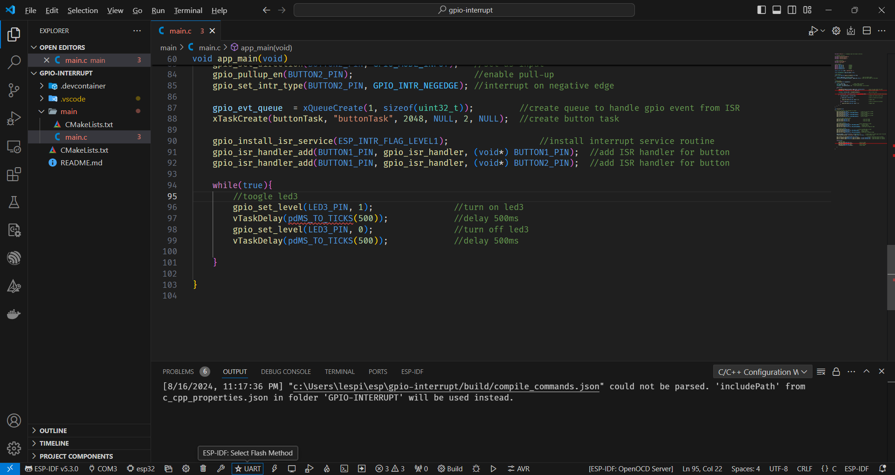

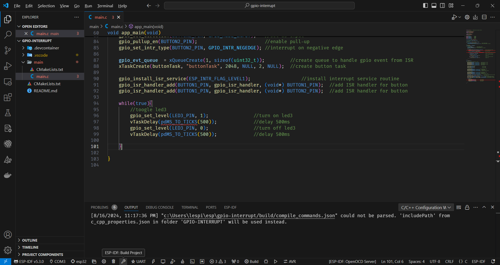


