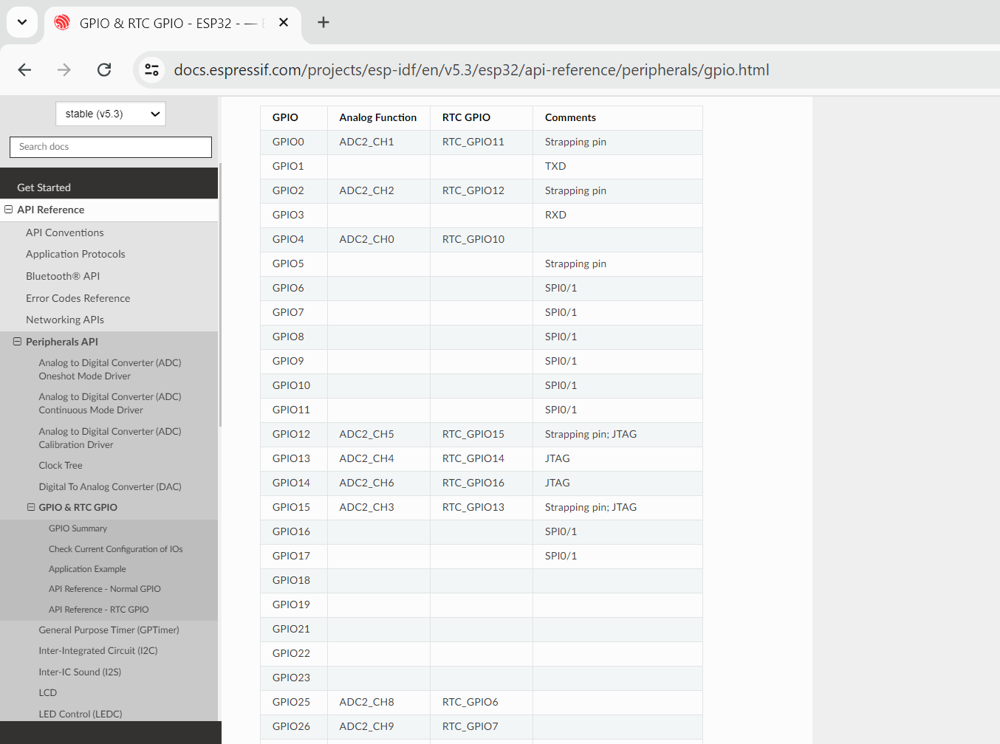

# 6-GPIo's

## PINOUT

https://docs.espressif.com/projects/esp-idf/en/v5.3/esp32/api-reference/peripherals/gpio.html

## Funções da API

Criar um projeto com GPIO's

> Clicar na extensão da Espressif e aguardar abrir o menu

> 

> Clicar em New project, ou  crtl+shipt+p ou ainda F1 para localizar ESP-IDF: New project

- Dar o nome do projeto

- Custom Board

- Escolher a placa alvo

-Valores atribuidos ao projeto, diretório errado na primeira imagem

- Descer e escolher um projeto exemplo "Chose Templates"

- Escolher os exemplos do ESP-IDF

- Escolher "sample project"

- Clicar em "Create project using template sample_project"

- Começa a ser gerado os arquivos e configurações do projeto escolhido

- Tive alguns problemas

- Agora vou novamente fazer todo o procedimento o diretório do projeto estava errado.

- A porta COM gerada foi a "COM6"

### Bits em Linguagem C – Conceito e Aplicação

https://embarcados.com.br/bits-em-linguagem-c/

> Os operadores &, |, ^ e ~ funcionam como apresentado anteriormente e têm as saidas conforme exibidos em suas tabelas verdades. Os operadores de deslocamento fazem o shift de bits para esquerda ou direita.

